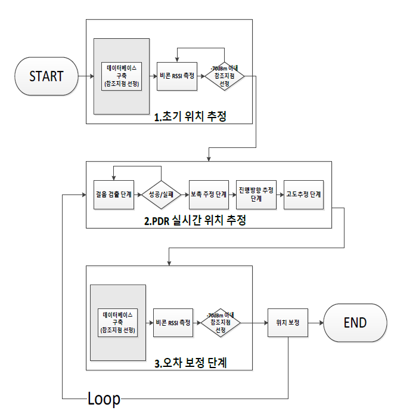

# 실내 위치 및 경로 추정 어플
임베디드 프로그래밍 프로젝트<br><br>

## 1. 작품 주제
GPS는 실외에서는 신호가 잘 터져 정확한 위치를 알려주지만, 실내에서는 신호가 불안정하여서 정확한 위치를 <br>
알져주지 못한다. 그래서 복잡한 지하상가 같은 곳은 헤매기 일쑤다.<br>

이에 실내에서도 실시간으로 갱신돼서 위치를 얻을 수 있고, 목적지까지 최단 경로를 알려주는 어플을 만들고자<br>
이것을 개발하게 됐다.<br>

 <br>

## 2. 개발 환경
* Android studio <br>
* JAVA <br>

## 3. 개발 기간
* 프로젝트 기간  :  18.5.1 ~ 18.6.5 <br>
* 프로젝트 인원  :  2명<br>

## 4. 개발 상세
사용자가 스마트폰을 소지하고 이동한다는 가정하에 스마트폰 센서를 가지고 이동거리를 구한다.<br>

실시간 이동거리 구하는 방법은 PDR기법을 사용하였다.<br>
PDR (Pedestrian Dead Reckoning) 기법은 스마트기기에 탑재돼 있는 가속도 센서를 통해 보행자의 걸음과 보폭을 계산해 추정한다.<br>

PDR 단계는 다음과 같다.<br>

```
1. 가속도 센서의 3방향 벡터 합을 구한다.
2. 필터링을 통해 노이즈 값을 제거한다. ( 고주파 필터링(HPF) + 저주파 필터링(LPF) )
3. 증가와 감소가 반복되는 데이터를 가지고 걸음 수를 측정한다.
4. 걸음 길이를 구해 걸음의 수를 곱하면 이동한 거리를 얻을 수 있다.
```

### 4.1 가속도 센서 벡터의 합 <br>

가속도 센서 3방향 벡터의 합을 구한다.<br>

### 4.2 필터링

필터링은 2가지 필터링을 거치는데 먼저, 고주파 필터링(High-pass Filtering)을 거친다.<br>
HPF는 중력 값을 제거한다.<br>

 <br>

a는 적절한 상수 값인데 여기서는 0.01로 적용하였다.<br>
acc_new는 새로운 가속도 값이며, acc_HPwg는 이전 가속도 값이다.<br>

다음으로 저주파 필터링(Low-pass Filtering)을 거친다.<br>

 <br>

x[]는 HPF을 거친 값이며, y[]는 HPF을 거친 값의 평균을 계산한 값이다.<br>

 <br>

이렇게 필터링을 통해 노이즈 값을 제거하여 사용자의 걸음 길이를 재기 위한 값을 제공한다.<br>

### 4.4 걸음 수 측정<br>

사람의 걸음은 50Hz로 얻어지는 가속도 센서 값이 발생한다. 이것은 증가와 감소를 반복하게 되는데<br>
한 주기를 한 번의 걸음으로 측정한다.<br>

### 4.5 보폭 측정

사용자의 걸음 길이를 측정하는 방법은 여러가지 있는데 그 중 Weinberg Approach를 사용한다.<br>

 <br>

k는 적절한 상수 값인데, 여기선 0.55를 적용하였다. 이렇게 구한 걸음 길이를 걸음 수에 곱하면<br>
대략적인 이동거리를 얻을 수 있다.<br>

### 4.6 이동 경로와 보행자 위치 층 추정<br>

걸음 검출 알고리즘을 이용하여 우리는 이동한 거리를 검출하였다. 여기에 방향까지 더하면 이동 경로를<br>
추정할 수 있다. 방향은 스마트폰의 지자기센서를 이용하여 추정하는 COMPAS시스템을 사용한다.<br>
하지만 프로젝트를 진행하면서 이 부분이 오차가 많이 발생하여 개선하려 해보았지만 해결하지 못하였다.<br>

보행자 위치 층 추정 알고리즘 또한 문제가 있었다. 기압계를 이용하여 복잡한 수식을 통해 얻는 고도 추정<br>
알고리즘을 적용하였지만, 너무 큰 오차가 발생하였고, 아직 해결하지 못한 상태다.<br>

### 4.7 지속적으로 나타나는 오차 보정

이렇게 다 완벽하게 구해도 이 방법은 스마트폰을 소지하는 형태나 스마트폰의 종류에 따라 오차가 발생한다.<br>
이동거리가 늘어날수록 오차가 점점 커진다. 따라서, 15m 정도 간격으로 비콘을 설치해두고 비콘과 결합한<br>
형태를 이용하였다.<br>

 <br>

 <br>

초기 위치 좌표는 PDR기법으로 적용하다가 비콘 신호 -70dBm 범위내에 들어서면, 사용자는 비콘 위치로 계산한다.<br>
비콘 위치를 벗어나면 다시 PDR기법을 통해 적용한다. 이렇게 최대한 오차를 줄여 사용자에게 위치를 보여준다.<br>

## 5. 작품 관련<br>

<br>

논문 경진 대회 포스터<br>


상 수여<br>

